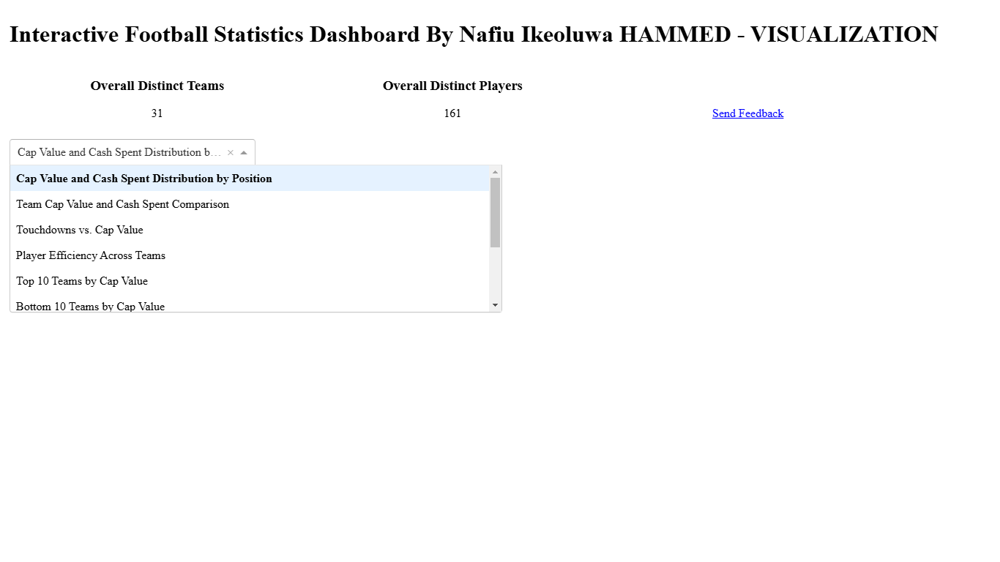
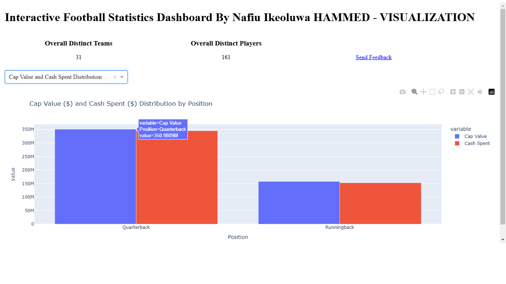
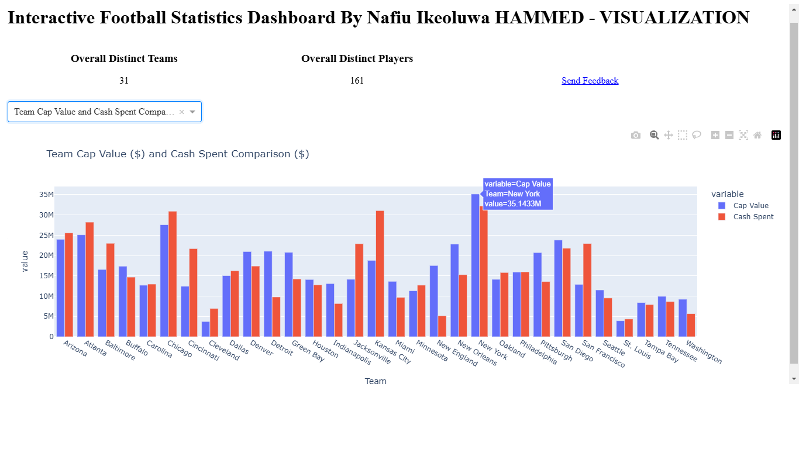
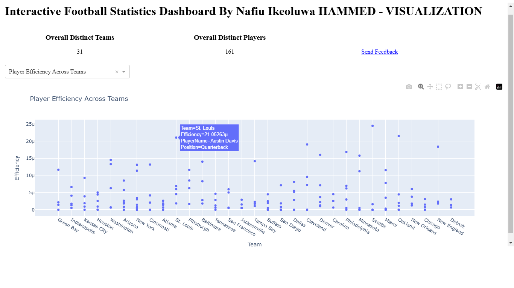
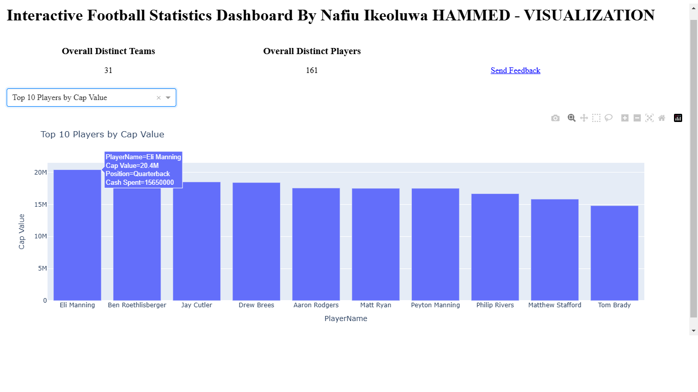
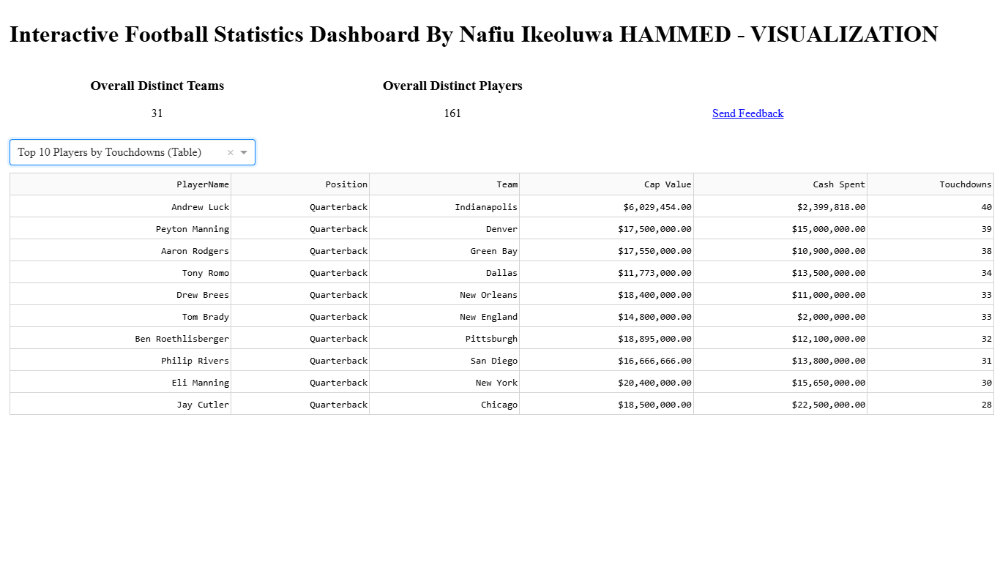

# Interactive Football Analytics Dashboard

An interactive football statistics dashboard developed using **Python, Pandas, Plotly, and Dash** to explore player- and team-level performance and financial statistics through interactive visualizations.

This project was originally completed as part of a **CS560 course assignment in Fall 2, 2024**. This repository is an archival portfolio version of the original project, with minor updates to improve portability and repository organization.

## Project Overview

The dashboard provides an interactive interface for exploring football statistics across teams, players, and positions.

Users can select different analyses from a dropdown menu and explore financial and performance information through interactive Plotly charts and Dash data tables.

The dashboard includes summary cards showing the number of teams and players represented in the dataset.



## Dashboard Features

The application provides several interactive analyses, including:

- Cap Value and Cash Spent distribution by player position
- Team-level Cap Value and Cash Spent comparison
- Touchdowns versus Cap Value
- Player efficiency across teams
- Top and bottom teams by Cap Value
- Top and bottom players by Cap Value
- Top teams by touchdowns
- Top players by touchdowns

Plotly interactivity allows users to inspect additional information through chart hover features, while Dash callbacks dynamically update the displayed visualization based on the user's selection.

## Selected Visualizations

### Cap Value and Cash Spent by Position

Comparison of financial statistics across player positions.



### Team Cap Value and Cash Spent Comparison

Team-level comparison of total Cap Value and Cash Spent.



### Player Efficiency Across Teams

Player efficiency is calculated in the implementation as:

```text
Efficiency = Touchdowns / Cap Value
```

for players with a Cap Value greater than zero.



### Top 10 Players by Cap Value

Player-level ranking based on Cap Value.



### Top 10 Players by Touchdowns

The dashboard can also present results using interactive Dash data tables.



## Dataset

The prepared dataset contains football player, team, performance, and financial information used by the dashboard.

The primary fields used in the analysis are:

- `PlayerName`
- `Team`
- `Touchdowns`
- `Cap Value`
- `Cash Spent`
- `Position`

The dataset is stored at:

```text
data/prepared_football_statistics.xlsx
```

## Technologies

- **Python**
- **Pandas** — data loading, aggregation, and preparation
- **NumPy** — numerical operations
- **Plotly Express** — interactive data visualizations
- **Dash** — interactive dashboard interface and callbacks
- **Dash DataTable** — interactive tabular results
- **Jupyter Notebook** — development environment

## Repository Structure

```text
Football-Analytics-Dashboard/
├── README.md
├── Football_Analytics_Dashboard.ipynb
├── data/
│   ├── README.md
│   └── prepared_football_statistics.xlsx
└── results/
    ├── README.md
    ├── dashboard_overview.png
    ├── cap_cash_by_position.png
    ├── team_cap_cash_comparison.png
    ├── player_efficiency_across_teams.png
    ├── top_10_players_by_cap_value.png
    └── top_10_players_touchdowns_table.png
```

## Running the Project

Clone the repository and install the required Python packages:

```bash
pip install pandas numpy plotly dash openpyxl
```

Launch Jupyter Notebook or JupyterLab from the repository root and open:

```text
Football_Analytics_Dashboard.ipynb
```

The notebook expects the dataset at:

```text
data/prepared_football_statistics.xlsx
```

Run the notebook cells to prepare the data and launch the Dash application.

## Project Background

This project was originally developed for **CS560 in Fall 2, 2024** as a course assignment focused on data preparation, visualization, and interactive dashboard development.

The GitHub version preserves the original analytical work and dashboard outputs while making minor portfolio-oriented changes, including replacing the original Google Drive-specific dataset path with a repository-relative path and organizing the dataset and selected results into dedicated folders.

The selected screenshots in the `results/` directory were extracted from the original submitted project outputs rather than regenerated for this repository.

## Author

**Nafiu Ikeoluwa Hammed**

## Project Status

Completed — **Fall 2, 2024**

This repository is maintained as an archival portfolio project.
